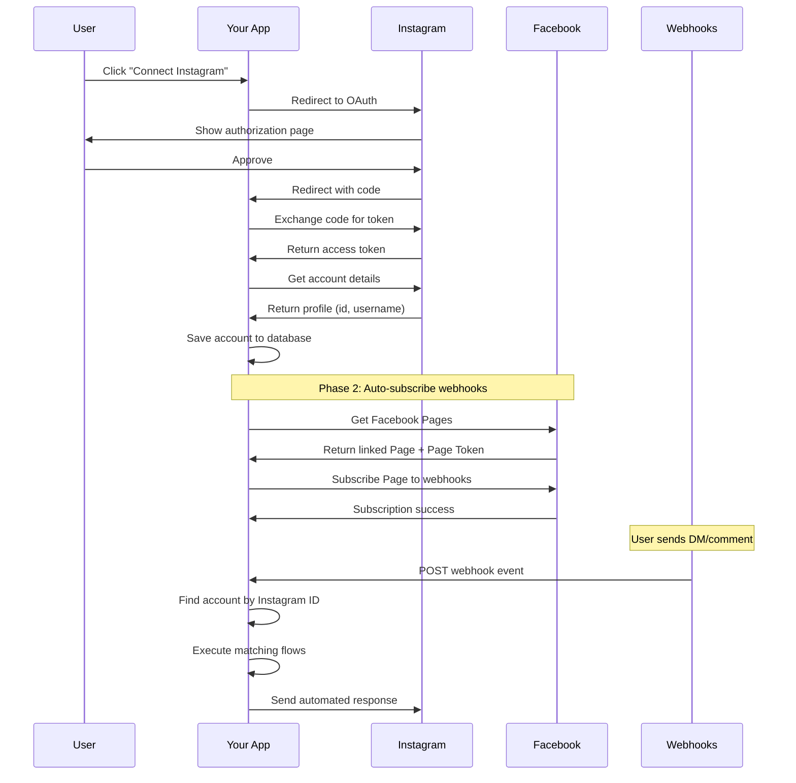

# Instagram Login & Webhook Subscription Guide

## Table of Contents
1. [Overview](#overview)
2. [Instagram OAuth Flow](#instagram-oauth-flow)
3. [Webhook Configuration](#webhook-configuration)
4. [Environment Setup](#environment-setup)
5. [How It Works Together](#how-it-works-together)

---

## Overview

The platform uses **Instagram Business Login** (OAuth) for account connection and a **two-phase webhook system** for receiving real-time events from Instagram.

### Key Components:
- **OAuth Flow**: Direct Instagram OAuth (not Facebook Login)
- **Webhook Verify Token**: Hardcoded as `"zenthra"` for all environments
- **Two-Phase Webhook Setup**:
  - **Phase 1**: Manual app-level subscription (one-time)
  - **Phase 2**: Automatic page-level subscription (per account)

---

## Instagram OAuth Flow

### 1. Configuration (`server/auth.ts`)

#### OAuth Scopes Requested:
```typescript
scope: [
  "instagram_business_basic",           // Basic profile info
  "instagram_business_manage_messages", // Send/receive DMs
  "instagram_business_manage_comments", // Moderate comments
  "instagram_business_content_publish", // Post content
].join(",")
```

#### Environment Variables Required:
- `INSTAGRAM_APP_ID` - Your Meta App ID
- `INSTAGRAM_APP_SECRET` - Your Meta App Secret
- `OAUTH_BASE_URL` (optional) - Custom OAuth callback URL
- `SESSION_SECRET` - Express session secret

### 2. OAuth Flow Steps

#### Step 1: User Initiates Connection
**Endpoint**: `GET /api/auth/instagram`

```typescript
// User must be logged in first
if (!req.isAuthenticated()) {
  return res.status(401).send("Must be logged in to connect Instagram");
}

// Build authorization URL
const authUrl = new URL("https://www.instagram.com/oauth/authorize");
authUrl.searchParams.set("client_id", process.env.INSTAGRAM_APP_ID);
authUrl.searchParams.set("redirect_uri", `${baseUrl}/api/auth/instagram/callback`);
authUrl.searchParams.set("response_type", "code");
authUrl.searchParams.set("scope", "instagram_business_basic,...");

// Redirect user to Instagram
res.redirect(authUrl.toString());
```

**What happens**: User is redirected to Instagram to authorize your app.

#### Step 2: Instagram Redirects Back with Authorization Code
**Endpoint**: `GET /api/auth/instagram/callback`

User is redirected back with: `?code=AUTHORIZATION_CODE`

#### Step 3: Exchange Code for Access Token

```typescript
// Exchange authorization code for short-lived token
const tokenResponse = await fetch('https://api.instagram.com/oauth/access_token', {
  method: 'POST',
  body: new URLSearchParams({
    client_id: process.env.INSTAGRAM_APP_ID,
    client_secret: process.env.INSTAGRAM_APP_SECRET,
    grant_type: 'authorization_code',
    redirect_uri: redirectUri,
    code: code as string,
  })
});

const tokenData = await tokenResponse.json();
const shortLivedToken = tokenData.access_token;
```

#### Step 4: Exchange for Long-Lived Token (60 days)

```typescript
const longLivedResponse = await fetch(
  `https://graph.instagram.com/access_token?` +
  `grant_type=ig_exchange_token&` +
  `client_secret=${process.env.INSTAGRAM_APP_SECRET}&` +
  `access_token=${shortLivedToken}`
);

const longLivedData = await longLivedResponse.json();
const finalToken = longLivedData.access_token; // Valid for 60 days
```

#### Step 5: Fetch Instagram Account Details

```typescript
const profileResponse = await fetch(
  `https://graph.instagram.com/me?fields=id,username,account_type&access_token=${finalToken}`
);

const profileData = await profileResponse.json();
// profileData.id = Instagram Business Account ID
// profileData.username = Instagram username
// profileData.account_type = "BUSINESS" or "CREATOR"
```

#### Step 6: Save Account to Database

```typescript
await storage.createAccount({
  userId: req.user!.id,              // Link to logged-in user
  instagramUserId: profileData.id,   // Instagram Business Account ID
  username: profileData.username,    // @username
  accessToken: finalToken,           // Long-lived token (60 days)
});
```

#### Step 7: Automatically Subscribe to Webhooks

```typescript
// Fire-and-forget webhook subscription (non-blocking)
webhookService.subscribeToWebhooks(profileData.id, finalToken)
  .then(subscribed => {
    if (subscribed) {
      console.log("✅ Webhooks configured successfully");
    }
  })
  .catch(err => console.error("Webhook subscription error:", err));

// Redirect user back to accounts page
res.redirect("/accounts?success=true");
```

### 3. Important Notes

#### Account ID Handling
```typescript
console.log("\n📱 Instagram Account Connection Debug:");
console.log(`  OAuth igUserId from token: ${igUserId}`);
console.log(`  Graph API me.id: ${profileData.id}`);
console.log(`  ⚠️  Using Graph API ID (${profileData.id}) as this is what webhooks send`);
```

**Critical**: We use `profileData.id` from Graph API, NOT `igUserId` from the token, because **webhooks send the Graph API ID**.

---

## Webhook Configuration

### 1. Webhook Verify Token

**Hardcoded for Simplicity**:
```typescript
private async getVerifyToken(): Promise<string> {
  // Hardcoded webhook verify token for all environments
  return "zenthra";
}
```

**Why hardcoded?**
- Same token works in preview AND production
- No need to manage tokens in database or environment variables
- Simplifies deployment and testing

### 2. Two-Phase Webhook System

Instagram webhooks require **TWO separate subscriptions**:

#### Phase 1: App-Level Subscription (Manual, One-Time)

**Where**: Meta App Dashboard → Products → Webhooks

**Configuration**:
```
Object: Instagram
Callback URL: https://your-app.replit.app/api/webhooks/instagram
Verify Token: zenthra
Subscribe to: messages, feed, mentions
```

**What it does**: Tells Meta to send Instagram events to your app.

#### Phase 2: Page-Level Subscription (Automatic, Per Account)

**Where**: Happens automatically when user connects Instagram account

**Code** (`server/instagram-webhook.ts`):

```typescript
async subscribeToWebhooks(instagramUserId: string, accessToken: string): Promise<boolean> {
  
  // 1) Verify app-level subscription exists
  const appAccessToken = `${this.appId}|${this.appSecret}`;
  const appSubResp = await fetch(
    `https://graph.facebook.com/v24.0/${this.appId}/subscriptions?access_token=${appAccessToken}`
  );
  const appSubData = await appSubResp.json();
  
  const igSub = appSubData?.data?.find((s: any) => s.object === "instagram");
  if (!igSub) {
    console.error("❌ App is NOT subscribed to Instagram webhooks");
    // Show Phase 1 setup instructions
    return false;
  }
  
  // 2) Get Facebook Page ID and Page Access Token
  const pagesResp = await fetch(
    `https://graph.facebook.com/v24.0/me/accounts?fields=id,name,access_token,instagram_business_account&access_token=${accessToken}`
  );
  const pagesData = await pagesResp.json();
  
  // Find the Page that manages this Instagram account
  const pageWithThisIG = pagesData?.data?.find(
    (p: any) => p.instagram_business_account?.id === instagramUserId
  );
  
  if (!pageWithThisIG) {
    console.error("❌ No Facebook Page found linked to Instagram account");
    return false;
  }
  
  // 3) Subscribe the Page to webhook fields
  const subscribeResp = await fetch(
    `https://graph.facebook.com/v24.0/${pageWithThisIG.id}/subscribed_apps?` +
    `subscribed_fields=messages,feed,mentions&` +
    `access_token=${pageWithThisIG.access_token}`,
    { method: 'POST' }
  );
  
  const subscribeData = await subscribeResp.json();
  
  if (subscribeData.success) {
    console.log("✅ Page successfully subscribed to webhook fields!");
    return true;
  }
  
  return false;
}
```

### 3. Why Two Phases?

**Instagram's Architecture**:
- Instagram Business Accounts are managed by Facebook Pages
- Webhooks are sent at the **Page level**, not Instagram account level
- You must subscribe the **Facebook Page** to receive events for its Instagram account

**Flow**:
1. User connects Instagram account → OAuth gives Instagram token
2. Use Instagram token to find linked Facebook Page
3. Get Page Access Token from Facebook
4. Subscribe Page to webhooks → Events start flowing

### 4. Webhook Verification

**Endpoint**: `GET /api/webhooks/instagram`

```typescript
app.get('/api/webhooks/instagram', async (req, res) => {
  const mode = req.query['hub.mode'];
  const token = req.query['hub.verify_token'];
  const challenge = req.query['hub.challenge'];

  const verifyToken = await webhookService.getVerifyToken(); // Returns "zenthra"

  if (mode === 'subscribe' && token === verifyToken) {
    console.log('✅ Webhook verified successfully!');
    res.status(200).send(challenge);
  } else {
    console.error('❌ Webhook verification FAILED');
    res.sendStatus(403);
  }
});
```

**What happens**: Meta sends a GET request with verify token. If it matches, we respond with the challenge to confirm.

### 5. Receiving Webhook Events

**Endpoint**: `POST /api/webhooks/instagram`

```typescript
app.post('/api/webhooks/instagram', async (req, res) => {
  console.log("📥 Webhook received:", JSON.stringify(req.body, null, 2));

  const { object, entry } = req.body;

  if (object !== 'instagram') {
    return res.sendStatus(200);
  }

  for (const item of entry) {
    const instagramAccountId = item.id; // Instagram Business Account ID
    
    // Find account in database
    const account = await storage.getAccountByInstagramUserId(instagramAccountId);
    
    if (!account) {
      console.error(`No account found for Instagram user ID: ${instagramAccountId}`);
      continue;
    }
    
    // Process events (comments, messages, mentions)
    if (item.messaging) {
      // Handle DM events
    }
    if (item.changes) {
      // Handle comment/mention events
    }
  }
  
  res.sendStatus(200);
});
```

---

## Environment Setup

### Required Secrets

Set these in Replit Secrets or `.env`:

```bash
# Meta App Credentials
INSTAGRAM_APP_ID=your_app_id
INSTAGRAM_APP_SECRET=your_app_secret

# OAuth Configuration
OAUTH_BASE_URL=https://your-app.replit.app  # Optional, auto-detected

# Session Management
SESSION_SECRET=your_random_secret_here

# Database (auto-configured by Replit)
DATABASE_URL=postgresql://...
```

### Meta App Configuration

**In Meta App Dashboard** (developers.facebook.com):

1. **OAuth Redirect URIs**:
   ```
   https://your-app.replit.app/api/auth/instagram/callback
   ```

2. **Deauthorize Callback**: (Optional)
   ```
   https://your-app.replit.app/api/auth/instagram/deauthorize
   ```

3. **Instagram Products**:
   - Enable "Instagram Basic Display" (if available)
   - Enable "Instagram Messaging API"

4. **Webhooks**:
   - Object: Instagram
   - Callback URL: `https://your-app.replit.app/api/webhooks/instagram`
   - Verify Token: `zenthra`
   - Fields: `messages`, `feed`, `mentions`

---

## How It Works Together

### Complete Flow: User Connects Account



### Example: User Sends DM

1. **User sends DM** to your Instagram account
2. **Instagram → Facebook** processes the message
3. **Facebook → Your App** sends webhook:
   ```json
   {
     "object": "instagram",
     "entry": [{
       "id": "17841403285682665",  // Instagram Business Account ID
       "messaging": [{
         "sender": { "id": "sender_ig_user_id" },
         "recipient": { "id": "17841403285682665" },
         "message": { "text": "Hello!" }
       }]
     }]
   }
   ```
4. **Your App** looks up account by `entry[0].id`
5. **Your App** finds matching flows with "message" trigger
6. **Flow Engine** executes flow nodes
7. **Your App** sends automated response via Instagram API

### Key Implementation Files

```
server/
├── auth.ts                    # OAuth flow implementation
├── instagram-webhook.ts       # Webhook subscription service
├── routes.ts                  # Webhook POST endpoint
└── flow-engine.ts            # Flow execution logic

client/src/pages/
└── accounts.tsx              # UI for connecting accounts
```

---

## Troubleshooting

### Common Issues

#### 1. "No account found for Instagram user ID"

**Problem**: Webhook arrives but account not in database

**Solutions**:
- Reconnect Instagram account via OAuth
- Verify the saved `instagramUserId` matches webhook `entry[0].id`
- Check console logs during OAuth for ID mismatch

#### 2. "Failed to fetch Facebook Pages"

**Problem**: OAuth token can't access Facebook Pages API

**Cause**: Instagram OAuth token needs Facebook permissions

**Current Status**: May require switching to Facebook Login with Instagram permissions

#### 3. Webhook verification fails

**Problem**: Meta can't verify your webhook

**Solutions**:
- Ensure verify token is exactly `zenthra` (lowercase, no quotes)
- Check webhook URL is accessible (not blocked by privacy settings)
- Verify Replit deployment is public

#### 4. Page subscription fails

**Problem**: Automatic Phase 2 subscription doesn't work

**Fallback**: Manual subscription in Meta Dashboard:
1. Go to App Dashboard → Webhooks
2. Subscribe Instagram object manually
3. Select all needed fields

---

## Security Considerations

### Token Storage
- Access tokens stored encrypted in database
- 60-day expiration (long-lived tokens)
- Automatic refresh not implemented (requires re-authentication)

### Webhook Security
- Verify token prevents unauthorized subscriptions
- Request signature validation recommended (not implemented)
- Account isolation (users only see their own accounts)

### Session Management
- Express sessions with secure cookies
- PostgreSQL session store
- Trust proxy enabled for Replit

---

## API Endpoints Summary

| Method | Endpoint | Purpose |
|--------|----------|---------|
| GET | `/api/auth/instagram` | Start OAuth flow |
| GET | `/api/auth/instagram/callback` | Handle OAuth callback |
| GET | `/api/webhooks/instagram` | Webhook verification |
| POST | `/api/webhooks/instagram` | Receive webhook events |
| GET | `/api/accounts` | List connected accounts |
| DELETE | `/api/accounts/:id` | Disconnect account |

---

## Next Steps

### For Production:
1. ✅ Complete Phase 1 (manual webhook setup in Meta Dashboard)
2. ✅ Connect Instagram account via OAuth
3. ⏳ Monitor Phase 2 auto-subscription logs
4. ✅ Test with real DM/comment
5. ✅ Verify flow execution in Activity page

### Potential Improvements:
- [ ] Implement token refresh mechanism
- [ ] Add webhook signature validation
- [ ] Switch to Facebook Login for better page access
- [ ] Handle token expiration gracefully
- [ ] Add webhook event retry logic

---

**Last Updated**: 2024
**Platform**: Replit
**Instagram API**: v24.0
